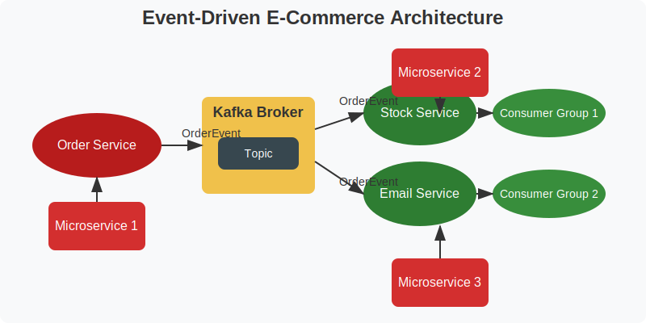

# E-Commerce Microservices with Kafka

A scalable, event-driven e-commerce application built with Spring Boot and Apache Kafka.



## Architecture Components

- **Order Service**: Processes customer orders
- **Stock Service**: Manages inventory
- **Email Service**: Handles notifications
- **Kafka Broker**: Event streaming backbone
- **Supporting Microservices**: Extend core functionality

## Event Flow

1. Order Service publishes OrderEvents to Kafka
2. Stock Service consumes events to update inventory
3. Email Service processes events for customer notifications

## Tech Stack

- Spring Boot 3.x
- Apache Kafka
- Spring Cloud
- Maven

## Quick Start
```bash
# Clone repository
git clone https://github.com/tharindu432/E-Commerce-with-Microservice.git

# Start infrastructure
docker-compose up -d

# Build and run services
./mvnw clean package
java -jar order-service/target/order-service.jar
```

